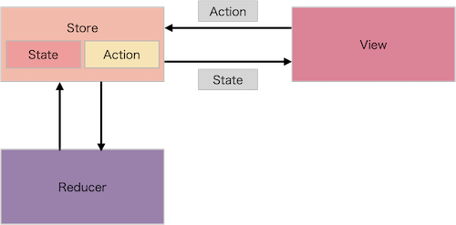

# ComposableArchitectureDemo
This is a demo project using [swift-composable-architecture](https://github.com/pointfreeco/swift-composable-architecture)

### The Composable Architecture
This architecture is similar to Redux. 
It relies on some types and values.
([Basic Usage](https://github.com/pointfreeco/swift-composable-architecture#basic-usage))

* A `View` has a `Store` that stores `State` that represents how app need to behave.
* `View` update when state changes.
* `State` changes through `Action`.
* `Action` is sent by `View` and consumed by `Store` and forwarded to `Reducer`.
* `Reducer` describes how to evolve the current state to the next state given an action.
* `ViewStore` is an object that can observe state changes and send actions.

### MEMO

#### Login Flow
navigate to the home screen if user is logged in and if not, navigate to the login screen.
* The state of root has states of Home and Login.
* [IfLet​Store](https://pointfreeco.github.io/swift-composable-architecture/IfLetStore/) safely unwraps a store of optional state.
* Root shows one of Home and Login that exists using `IfLet​Store`.

#### Login
login via API.
* `View` send `loginButtonTapped` action and
* `Reducer` run API request and return `Effect`.
* `Effect` encapsulates a unit of work of side effect, and can feed data back to the Store

#### Select row from List
* set destination to NavigationLink with `IfLet​Store`.
* send `Action` with selected data through NavigationLink's tag.
* `Reducer` instantiate `State` of destination when receive the action.
* I can set the value need to pass to the destination when instantiate the `State`.

#### Receive event in another screen
The Composable Architecture can share state across many screens so that mutations in one screen can be immediately observed in another screen.
* `Reducer` can combine reducers and merging all of the effects.
